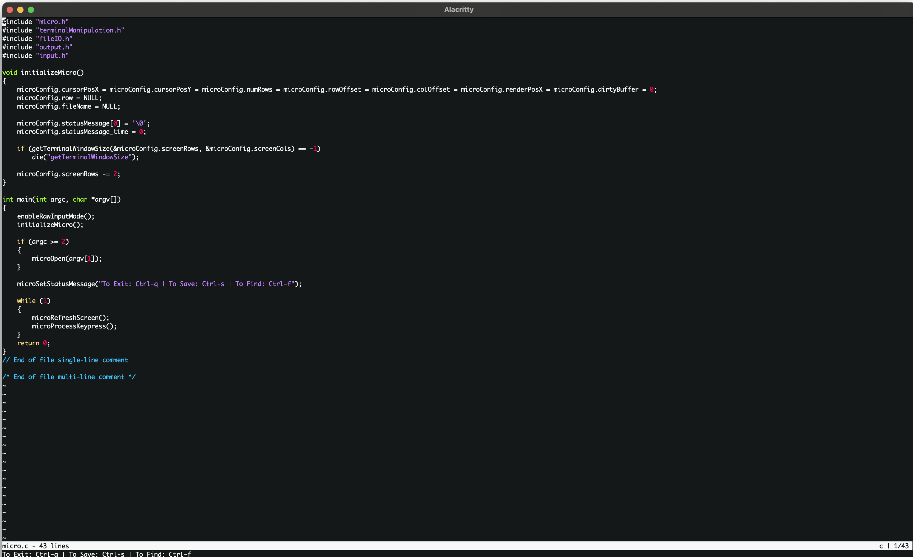

# ```Micro```

```Micro``` is a concise, stand-alone, dependency free, *NIX cross-platform CLI editor written in pure ```C```, and built from scratch!  
```Micro``` is inspired by the likes of [GNU ```Nano```](https://www.nano-editor.org/) and the ever infamous [```Vi/m```](https://www.vim.org/) and other POSIX compliant CLI editors.  

## Editor Preview

```Micro```'s welcome screen:


```Micro``` viewing ```micro.c```:


You can also see ```Micro``` in action via the asciinema screencast below:
[](https://asciinema.org/a/PmNYYUoUcdU4OFMx0oS4hq04X)

## Features

- ```Micro``` is *NIX cross-platform - it can run anywhere where a *NIX terminal can aka (Linux/macOS/BSD derivatives) - essentially any POSIX compliant OS with a terminal.

- Supports syntax highlighting (currently only ```.c```, ```.h```, ```.cpp``` and ```.cc``` files support syntax highlighting), keyword searching, save and save-as functionality.

- Screen size adaptable - supports any terminal screen size, and has resizing functionality.

- Dependency free and extremely portable - no external libraries required other than a ```C``` compiler, and the [C Standard Library](https://en.wikipedia.org/wiki/C_standard_library).

## Usage

```Micro``` can be complied via the included ```Makefile```, simply type:

```bash
$ make
```

Then pass in a file name argument (or no argument to open ```Micro``` blank) to view the file:

```bash
$ ./micro <filename>
```

| Functionality                  |                        Key-Combination                         |
| :----------------------------- | :------------------------------------------------------------: |
| To exit                        |                         ```Ctrl + q```                         |
| To force quit                  |                      ```Ctrl + q``` twice                      |
| To save                        |                         ```Ctrl + s```                         |
| To save-as (from blank editor) |      ```Ctrl + s``` then enter filename then ```Enter```       |
| To abort save                  |                           ```Esc```                            |
| To search for keyword          |       ```Ctrl + f``` then input keyword then ```Enter```       |
| To go to next matching keyword | ```Ctrl + f``` then input keyword then navigate via arrow keys |
| To abort search                |                           ```Esc```                            |
| To navigate                    |                       Arrow keys to move                       |

## References and Credits

A lot of the heavy lifting in terms of logic and terminal manipulation was done via the use of [VT100](https://vt100.net/) escape sequences. The VT100 docs ```https://vt100.net/docs/vt100-ug/```, and ANSI Escape Codes Wikipedia page ```https://en.wikipedia.org/wiki/ANSI_escape_code``` were used as reference.  

In addition, the screencast of the terminal was done using [```asciinema```](https://asciinema.org/).  

## ~~LICENSE~~ LICENCE

`Micro` is ~~licensed~~ licenced under the [BSD 3-Clause licence](https://opensource.org/licenses/BSD-3-Clause). For more information, check out [LICENCE](LICENSE).

## TODO: Add comments
